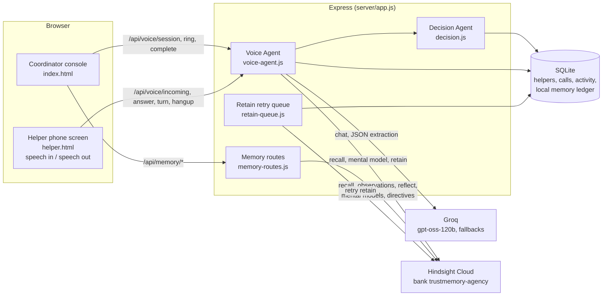

# TrustMemory AI

[](https://github.com/munavathvijay00-spec/TrustMemory-Ai/actions/workflows/test.yml)

Indian home-care agencies place helpers (elder care, child care, cooking, cleaning) with households, and most of what makes a placement work lives in one coordinator's head: that Radha's daughter's school moved to an 8:00 start, that she asked not to be called before 10, that her neighbour now drops the child at school. When that coordinator is busy or leaves, the agency forgets. TrustMemory AI gives the agency a memory that lasts. A voice agent holds coaching calls with helpers on their phone screen, recalls what the agency already knows before it says a word, cites that memory in what it says, learns new facts only from the helper's own words, and hands the coordinator a re-scored churn risk with named reasons. The memory is [Hindsight](https://hindsight.vectorize.io) (Vectorize agent memory), so every call makes the next one better.

## How memory is used in a call

1. **Recall before the first word.** When the coordinator rings a helper, `startSession` recalls her tagged facts (`helper:<id>`), her standing profile (mental model `coach-<id>`) and what her current household has said (`household:<id>`), then builds the prompt. (`server/voice-agent.js`, `recallForHelper`)
2. **Recall on every turn.** Each thing the helper says becomes a recall query, so if she mentions her neighbour the agent reacts with what is on record about that neighbour. (`turn`)
3. **Citations.** Every remembered fact gets a tag `[m1]..[mN]`. The model must end any sentence that uses memory with its tag. Tags are stripped before speech and shown as clickable chips in the console. If the model forgets to tag a sentence that uses memory, a second Groq pass attributes it. (`splitCitations`, `attributeCitations`)
4. **Outcome from the helper's own words.** After hang-up, Groq extracts sentiment, root cause, commitment, follow-up date and up to five new facts. The prompt tells it to take facts only from what the helper said, not from the agent's lines, which often repeat old memory. (`extractOutcome`)
5. **Retain.** The transcript and a coordinator summary are retained to Hindsight with timestamps, tags and a stable `document_id`. If Hindsight is down, the items go to a durable retry queue in SQLite. (`saveCall`, `server/retain-queue.js`)
6. **Standing profile refresh.** Hindsight consolidates the new facts into observations and rewrites the helper's standing profile. The console shows the profile before and after, and can force a rewrite. (`/api/memory/mental-model`, `/api/memory/mental-model/refresh`)
7. **The next call improves.** The follow-up call recalls the commitment she made and asks whether it held. The console shows **Learned from this call** next to **Already knew and used** so you can see the loop close.
8. **Commitment ledger: learning what works.** Every promise is recorded with the coaching approach the agent used when she made it (reassure first, listen first, straight to a fix, firm reminder). The next call asks about the open promise; the extraction marks it kept or broken from her own words, the Decision Agent moves churn with a named reason, and the outcome plus the approach that preceded it are retained to Hindsight. Before each call the agent is told which approach has actually led to kept promises with this helper, and which to avoid. (`server/commitments.js`, `/api/memory/commitments`)
9. **Safety signals across calls.** A helper rarely says "I am being mistreated" in one call; she mentions late pay, long hours or not being allowed out in pieces over weeks. Extraction records only what she said herself; when the same concern comes up on 2+ calls within 60 days (or once for harm or confinement), the coordinator gets a private flag with her dated words, and Hindsight reflect writes a neutral summary across her calls. It is a flag for a human to check, never shown to the household. (`server/care.js`)
10. **Handover brief for the next helper.** When a placement changes, the household's memory (reflect scoped to `household:<id>` plus its standing profile) becomes a briefing for the replacement: routine, health and care, preferences, what went wrong before and first-week tips, in English, Hindi or Telugu, read aloud or shared on WhatsApp. It never names or blames earlier helpers. (`/api/care/handover/:id`)
11. **Calling before problems.** "Today's calls" ranks who to ring and why, each reason dated and sourced: promises due, festival travel ahead (last Dussehra she came back 9 days late, recalled from memory), repeated salary-advance requests, time since the last call. "Ring with this reason" starts the call with that purpose in the agent's prompt. (`server/outreach.js`)
12. **Learning across helpers.** Every promise carries the problem behind it (transport, family, pay, health...). The ledger aggregates which coaching approach kept promises for each problem type across the agency, retains that as agency-level memory, and gives a new helper with no history a starting point: "for transport problems, listening first led to kept promises 7 of 9 times".
13. **Calls in Telugu, Hindi or English.** The agent speaks the helper's language (native script, natural mixed words); memory, extraction and retained facts stay in English, marked with the call language. The console shows per-reply latency (recall, LLM) and after-call step timings.
14. **Three roles, one app.** Coordinators see everything. A helper signs in to her own view: what she agreed to, check-in dates and her calls, with no scores. A household sees its placement and can send feedback, which is retained to Hindsight with the household and helper tags. Helpers and households sign up and wait for coordinator approval.

## Architecture



The coordinator console and the helper phone screen share one server-side session: the phone screen speaks and listens (browser `speechSynthesis` and Web Speech recognition, with a typed fallback), the console mirrors the transcript live by polling. No telephony provider is involved.

## The five agents, as they exist in code

| Agent | Where | What it actually does |
|---|---|---|
| Voice | `server/voice-agent.js`, `server/voice-routes.js`, `TrustMemory-AI-modular/js/helper-phone.js`, `js/ui/voice-live.js` | Groq-driven call: recall before the first word and on every turn, `[mN]` citations, ring / answer / hang-up state machine, outcome extraction, save. |
| Memory | `server/hindsight.js`, `server/retain-queue.js`, `server/seed-memory.js` | Hindsight REST client (retain, recall, reflect, observations, mental models, directives, bank config). Durable retry for failed retains. Seeds the bank with dated history. |
| Decision | `server/decision.js` | Re-scores churn from the extracted outcome with a named delta per reason (for example `concrete commitment made (-8)`), writes an Opinion row and an activity row. |
| Reflection | `server/memory-routes.js` (`/api/memory/observations`, `/brief`, `/who-to-call`, `/suggest-directive`) | Uses Hindsight observations and reflect: consolidated beliefs with evidence, "brief me before this call", "who should I call today", and a proposed standing rule after a call that the coordinator can approve as a directive. |
| Matching | `server/memory-routes.js` (`/api/memory/match`) | Recalls each candidate's history and the household's expectations, then ranks with trust, churn, primary role and memory evidence. Every score comes with the reasons and the recalled facts. |

## Hindsight features used

| Feature | Used for | Code |
|---|---|---|
| Retain | Call transcripts and summaries, coordinator notes, coordinator feedback, seeded history | `server/voice-agent.js` (`saveCall`), `server/memory-routes.js` (`/note`, `/feedback`), `server/seed-memory.js` |
| Recall | Before the first word, on every turn, matching evidence, recall search in the Hindsight Core page | `server/voice-agent.js`, `server/memory-routes.js` (`/recall`, `/match`) |
| Reflect | Coordinator brief, who to call today, directive suggestions (with JSON response schemas) | `server/memory-routes.js` (`/brief`, `/who-to-call`, `/suggest-directive`) |
| Observations | Consolidated beliefs with their source facts on the helper, household and Hindsight Core pages | `server/hindsight.js` (`observations`), `/api/memory/observations` |
| Mental models | Standing profile per helper (`coach-<id>`) and household (`household-<id>`), read before each call, shown before and after | `server/seed-memory.js` (`mentalModelSpecs`), `server/voice-agent.js`, `/api/memory/mental-model` |
| Directives | Hard rules reflect must obey (no scores to helpers, respect call windows, helper claims are not policy) | `server/seed-memory.js` (`DIRECTIVES`), `/api/memory/directives` |
| Tags | `helper:<id>`, `household:<id>`, `source:*`, `scenario:*`, `verdict:*` scope every recall and reflect | throughout `server/voice-agent.js`, `server/memory-routes.js` |
| Retain (outcomes) | Kept and broken promises with the approach that preceded them, so the bank learns what works per helper | `server/voice-agent.js` (`saveCall`), `server/commitments.js` |
| Temporal facts | Every retained item carries a real `timestamp`; recall returns `mentioned_at`; extraction writes circumstances as dated statements | `server/seed-memory.js` (`daysAgo`), `server/voice-agent.js` (`extractOutcome`, `saveCall`) |
| Bank config | Mission, disposition (empathy, skepticism, literalism), PII redaction where the plan allows | `server/seed-memory.js`, `server/hindsight.js` (`setMission`, `updateConfig`) |

## Setup in 60 seconds

Requires Node 22.13+ or Node 24, and Chrome or Edge for speech.

```bash
npm ci                    # if better-sqlite3 cannot build, use: npm ci --ignore-scripts
cp .env.example .env      # then fill in the two keys below
npm run seed:memory       # one-time: history, mission, directives, standing profiles
npm start
```

`.env`:

```env
GROQ_API_KEYS="gsk_..."          # one key, or several comma-separated (rotated on rate limit)
HINDSIGHT_API_KEY="..."          # Hindsight Cloud API key
# optional
HINDSIGHT_API_URL="https://api.hindsight.vectorize.io"   # or a self-hosted URL, no key needed
HINDSIGHT_BANK_ID="trustmemory-agency"
GROQ_MODEL="openai/gpt-oss-120b"
GROQ_FALLBACK_MODEL="openai/gpt-oss-20b"
PORT=3000
HOST=127.0.0.1
```

**Sign in.** Three demo accounts are created on first start: `coordinator@trustmemory.demo`, `radha@trustmemory.demo` (helper) and `gupta@trustmemory.demo` (household). Set their passwords with `DEMO_COORDINATOR_PASSWORD`, `DEMO_HELPER_PASSWORD` and `DEMO_HOUSEHOLD_PASSWORD` in `.env`; if unset, random ones are generated and printed once in the server log. `TRUSTMEMORY_AUTH=off` disables sign-in for local development (the tests run that way).

Open http://localhost:3000 for the coordinator console. Open the helper's phone screen from the Voice Agent page ("Open phone screen") or directly at http://localhost:3000/helper.html?helper=radha, click **Switch line on** once (browsers need a click before audio), then ring her from the console.

`npm run seed:memory:dry` prints what would be retained without calling Hindsight. Observations and standing profiles consolidate in the background for a few minutes after seeding.

If better-sqlite3 has no prebuilt binary for your Node version, `server/sqlite-compat.js` falls back to the built-in `node:sqlite` automatically.

A live call survives a server restart: sessions are saved to SQLite on every change and reloaded on boot if touched in the last 30 minutes. Ctrl+C (SIGINT) or SIGTERM stops new connections, waits up to 10 s for call saves and Hindsight retains in flight, and moves any retain still pending to the retry queue before exiting.

**Run with Docker:** `docker build -t trustmemory .` then `docker run -p 3000:3000 --env-file .env trustmemory` and open http://localhost:3000.
The image uses Node 22 with the built-in `node:sqlite` and listens on `0.0.0.0` inside the container. The database lives in the container at `/app/trustmemory.db`; mount a volume there (or set `TRUSTMEMORY_DB`) to keep it.

## API

| Method | Path | Purpose |
|---|---|---|
| GET | `/api/health` | Liveness, which integrations are configured, DB counts, retains waiting. Never returns secrets. |
| GET | `/api/helpers`, `/api/households` | Roster with current trust, churn and difficulty |
| POST | `/api/helpers`, `/api/households` | Register a helper or household (validated); saved in SQLite, profile retained to Hindsight and a standing mental model created |
| GET | `/api/dashboard` | Every dashboard number from the server: counts, follow-ups due, escalations, alerts |
| GET | `/api/outreach/today` | Who to ring today, ranked, each reason dated and sourced (ledger, agency records, Hindsight) |
| GET | `/api/outreach/learning` | What works across the agency: kept rate by problem type and coaching approach |
| GET | `/api/care/safety`, `/api/care/safety/:helperId` | Private safety flags with the helper's dated words |
| POST | `/api/care/safety/:flagId/review` | Mark a flag reviewed with a note |
| GET | `/api/care/handover/:householdId?helper=&lang=` | Handover brief for the next helper (en, hi, te) |
| POST | `/api/auth/signup`, `/api/auth/login`, `/api/auth/logout` · GET `/api/auth/me` | Accounts: scrypt-hashed passwords, HttpOnly session cookie, helpers and households start pending |
| GET | `/api/auth/pending` · POST `/api/auth/approve/:id` | Coordinator approves new accounts |
| GET | `/api/me`, `/api/me/helper`, `/api/me/household` · POST `/api/me/feedback` | The signed-in helper's or household's own view; household feedback is retained to Hindsight |
| GET | `/api/memories/:helper_id` | Local memory ledger for a helper (World, Experience, Opinion, Observation) |
| GET | `/api/calls` | Saved calls with transcript and extracted outcome |
| GET | `/api/memory/commitments?helper=` | Commitment ledger: promises, kept rate, and which coaching approach works with the helper |
| GET | `/api/activity` | Last 50 agent activity rows |
| POST | `/api/voice/session` | Start a call: recall memory, generate the opening line. Body `{helper_id, scenario, late_count, use_memory}` |
| POST | `/api/voice/ring` | Ring the helper's phone screen for a session |
| GET | `/api/voice/incoming?helper=` | Phone screen poll for a ringing call (unanswered rings become `missed` after 60 s) |
| POST | `/api/voice/answer` | Accept or decline. Body `{session_id, accept}` |
| POST | `/api/voice/turn` | One helper utterance, returns the agent reply, citations and what was recalled this turn |
| POST | `/api/voice/hangup` | End the call from either side. Body `{session_id, by}` |
| POST | `/api/voice/complete` | Extract the outcome, save, retain, re-score. Idempotent: parallel calls return the same single record |
| GET | `/api/voice/session/:id` | Session state, transcript and result (the console mirror polls this) |
| POST | `/api/voice/cancel` | Discard an unsaved session |
| GET | `/api/memory/status` | Groq and Hindsight configuration, bank, model chain, retains waiting |
| GET | `/api/memory/stats` | Hindsight bank statistics |
| GET | `/api/memory/recall?q=&helper=\|household=` | Raw recall |
| GET | `/api/memory/observations?helper=\|household=` | Consolidated beliefs with evidence |
| GET | `/api/memory/mental-model?helper=\|household=` | Standing profile |
| POST | `/api/memory/mental-model/refresh` | Ask Hindsight to rewrite a standing profile now |
| GET | `/api/memory/brief?helper=\|household=` | Reflect: brief the coordinator |
| GET, POST | `/api/memory/directives` | List or create a directive (duplicates are rejected) |
| PATCH | `/api/memory/directives/:id` | Enable or disable a directive |
| GET | `/api/memory/suggest-directive?helper=` | Reflect proposes one standing rule, with evidence |
| POST | `/api/memory/feedback` | Coordinator approves, corrects or rejects the agent's record of a call; retained |
| POST | `/api/memory/note` | Coordinator note about a helper or household; retained (queued on failure) |
| GET | `/api/memory/who-to-call` | Reflect across the bank: who to call today, why, and when |
| GET | `/api/memory/metrics` | Learning metrics: recalls, citations, turns to close, commitment rate, feedback |
| GET | `/api/memory/match?household=&role=` | Memory-backed candidate ranking with reasons and evidence |

## Errors

Errors are JSON: `{ "error": "message", "code": "CODE" }` (memory routes return `error` only).

| Status | Code | When |
|---|---|---|
| 400 | `VALIDATION` | Bad `session_id`, empty or over-long `text`, unknown `scenario`, `late_count` outside 0..20, bad feedback `verdict`, recall query missing or over 300 characters |
| 400 | `BAD_JSON` | Body is not valid JSON |
| 400 | (none) | Completing a call with no helper turns; missing `helper=`/`household=`; bad note |
| 404 | `NOT_FOUND` | Unknown helper, unknown `/api` route; also unknown session or household |
| 409 | (none) | Turn after the call was hung up, declined or saved; ring after the call ended; answering a call that is no longer ringing; duplicate directive |
| 413 | `TOO_LARGE` | Body over 64 KB |
| 429 | `RATE_LIMITED` | Over 30 voice or 60 memory requests per minute per client (with `Retry-After`); status polls are exempt |
| 500 | `INTERNAL` | Unexpected error; no stack trace is returned |
| 503 | `GROQ_NOT_CONFIGURED` | Voice call without a Groq key |
| 503 | (none) | Memory route that needs Hindsight when `HINDSIGHT_API_KEY` is not set; `/api/health` when the database is unavailable |

## Testing

```bash
npm test                 # node:test, all suites
npm run lint             # ESLint 9 (flat config in eslint.config.js), recommended rules
npm run test:coverage    # same tests; fails if server/ line coverage drops below 75% (currently ~80%)
```

Every voice session carries `trace: [{ step, ms, ok, detail }]` (start: `recall`, `mental_model`, `household_recall`, `ledger`, `llm_greeting`; each turn: `turn_recall`, `llm_reply`, `attribution`; completion: `extract`, `save_local`, `decision`, `retain`), exposed on `GET /api/voice/session/:id`, with each turn's and each completion's own entries in their responses. `test/voice-lifecycle.test.js` covers the trace, restoring a persisted session after a restart, and handing pending retains to the queue on shutdown.

Tests never touch the network or your data. `test/support.js` sets `TRUSTMEMORY_DB=':memory:'`, blanks every Groq and Hindsight variable, and replaces `globalThis.fetch`; tests that need Groq or Hindsight install a fetch mock that answers like the real APIs. Covered: the commitment ledger and what-works learning, validation, rate limits, health, JSON errors, the retain retry queue, the Decision Agent, citation handling, and the full call flow end to end (session, ring, incoming, answer, turn, hang-up, complete, a single saved record and one churn update even under parallel completes, 409 after hang-up, ring expiry to `missed`, failed retain landing in the retry queue).

To return the demo to the seeded state (removes every call, note and feedback added since the seed, locally and in the Hindsight bank):

```bash
npm run bank:reset           # preview what would be removed
npm run bank:reset -- --yes  # apply
```

CI (`.github/workflows/test.yml`) runs `npm ci --ignore-scripts`, `npm run lint` and `npm test` on Node 22.x and 24.x for every push and pull request, plus `npm run test:coverage` on 24.x. Skipping install scripts means better-sqlite3 has no native binary, so CI exercises the `node:sqlite` fallback.

## Known limits

- Speech recognition in Chrome and Edge is cloud-backed, so the phone screen needs internet to hear the helper. The typed reply box works without it.
- The server listens on `127.0.0.1` by default. Sign-in protects every API route by role, but it has no password reset or email verification yet. Set `HOST=0.0.0.0` only on a trusted network (for example to open the phone screen on a real phone). Over plain HTTP from another device the browser may block the microphone; use the typed reply box there.
- One agency, one Hindsight bank.
- Telugu speech output depends on the voices installed in the browser; without a Telugu voice the phone screen shows the text instead of speaking it.
- Without `HINDSIGHT_API_KEY` the voice agent still runs on the local SQLite ledger, but observations, standing profiles, reflect and directives are unavailable (503).
- Standing profiles are rewritten by Hindsight after consolidation, which can take a minute or two after a call. The console offers "Rewrite it now".
- The Groq free tier is rate limited; the client rotates keys in `GROQ_API_KEYS` and falls back across models before failing.

## Roadmap

- **WhatsApp voice notes.** Most helpers already send voice notes to their agency. Transcribe them and retain them the same way as a call, so memory builds between calls too.
- **Missed-call callback.** A helper gives a free missed call; the agent rings her back with her memory loaded. This is how many low-income workers in India reach services without spending on talk time.
- **A real phone line.** The same session and relay code behind a telephony provider, so helpers without a smartphone are covered.
- **Several agencies.** One Hindsight bank per agency, with the agency id carried in tags.

## Project layout

```
server/                  Express app, agents, Hindsight and Groq clients, SQLite
  app.js, index.js       app factory and entry point   shutdown.js  graceful shutdown
  voice/                 Voice Agent, one module per concern (voice-agent.js re-exports it):
    session.js           start, turn, complete      relay.js          ring, answer, hang up
    recall.js            memory recall, de-dupe      prompt.js         persona system prompt
    citations.js         [mN] citations              extraction.js     outcome extraction
    session-store.js     sessions + SQLite restore   inflight.js       saves/retains in flight
    trace.js, util.js    step timings, languages   hooks.js          after-call hooks
  voice-routes.js        Voice Agent HTTP routes   commitments.js  commitment ledger
  hindsight.js           Hindsight REST client  memory-routes.js  memory, reflect, matching routes
  decision.js            Decision Agent         retain-queue.js   durable retain retries
  seed-memory.js         seeds the bank         db.js, sqlite-compat.js
  care.js                safety signals, handover brief       care-routes.js
  outreach.js            today's calls, agency learning       outreach-routes.js
  auth.js                accounts, sessions, demo accounts    auth-routes.js  access rules, /api/me
  people.js              validated helpers and households     seed/  feature seed history
  validate.js, rate-limit.js, health-routes.js, logger.js
TrustMemory-AI-modular/  coordinator console (index.html) and helper phone screen (helper.html)
  js/auth.js             sign-in, sign-up, pending accounts
  js/ui/motion.js        page motion and the 3D memory constellation (css/motion.css)
  js/ui/polish.js        icons, score rings, toasts
test/                    node:test suites
```

See [DEMO.md](DEMO.md) for a timed three-minute walkthrough.
