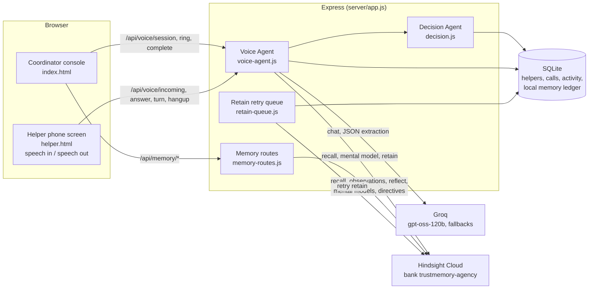

# TrustMemory AI

[](https://github.com/munavathvijay00-spec/TrustMemory-Ai/actions/workflows/test.yml)
    [](https://trustmemory-ai.onrender.com)

> Lakshmi mentioned her salary was late on three calls, weeks apart. No single call sounded alarming.
> TrustMemory noticed the pattern and flagged it, privately, for the coordinator.

A voice agent for Indian home-care agencies that remembers every helper, built on [Hindsight](https://hindsight.vectorize.io) memory.

- **Across calls:** it recalls what the agency knows before its first word and on every turn, and cites every fact it uses.
- **Across people:** a household's memory becomes a briefing for the next helper, in her language (English, Hindi or Telugu).
- **Across time:** "last Dussehra she came back 9 days late" puts her on today's call list weeks before the festival.

**Try it in 60 seconds:** open [trustmemory-ai.onrender.com](https://trustmemory-ai.onrender.com), sign in as the coordinator (credentials are in our submission), go to **Dashboard**, then **Today's calls**, then **Ring with this reason**. Code: [github.com/munavathvijay00-spec/TrustMemory-Ai](https://github.com/munavathvijay00-spec/TrustMemory-Ai).

**[Watch the 3-minute demo](https://youtu.be/Skc0GNiy0uk)**


## Why

Indian home-care agencies place helpers (elder care, child care, cooking, cleaning) with households. What makes a placement work lives in one coordinator's head: that Radha's daughter's school now starts at 8:00, that she asked not to be called before 10, that last Dussehra she went home and came back 9 days late. When that coordinator is busy or leaves, the agency forgets, and the helper quits or the household is left without cover. TrustMemory gives the agency a memory, and agents that use it.

## What it does

| | |
|---|---|
| **Calls that remember** | The voice agent recalls what the agency knows before its first word and again on every turn, cites each remembered fact (`[m1]`), and learns only from what the helper herself said. English, Hindi or Telugu. |
| **Calls before problems** | *Today's calls* ranks who to ring and why: a festival ahead and her travel history, repeated salary advances, a promise due for a check-in. One click rings her with that reason. |
| **Notices patterns** | A helper rarely says "I am mistreated" in one call. When her own words about late pay, long hours or not being allowed out repeat across calls, the coordinator gets a private safety flag with her dated quotes. |
| **Keeps promises honest** | Every promise gets a check-in date and the coaching approach used; the agency learns which approach keeps promises for each kind of problem, across helpers. |
| **Hands over a home** | When a placement changes, the household's memory becomes a briefing for the next helper, in her language, without naming or blaming anyone. |
| **Three roles** | Coordinators see everything. Helpers see what they agreed, plan festival leave and tell the agency about problems, with no scores ever. Households give feedback, ask for cover and write what the next helper should know. |

## Screens


| Live call, in Telugu | The helper's phone |
|---|---|
|  |  |
| **Helper profile** | **Handover brief** |
|  |  |
| **The helper's own view** | **Dark mode** |
|  |  |

## Live deployment

TrustMemory AI is deployed on Render and running at **https://trustmemory-ai.onrender.com**.

- One Docker web service (the `Dockerfile` in this repo) serves the API and all pages: the coordinator console, sign-in, the helper and household views, and the helper phone screen at `/helper.html?helper=radha`.
- Region Singapore, deployed from the `dev` branch, with a health check on `/api/health`.
- It uses the same Hindsight bank (`trustmemory-agency`) and Groq models as a local run; secrets are set in the Render dashboard, never in the repo.
- The free plan sleeps when idle, so the first visit after a quiet spell takes about 50 seconds. Local data (calls, requests, new sign-ups) resets on each redeploy; the Hindsight memory is kept.
- Sign in with the demo accounts below; passwords are shared with judges on request.

## Quick start

Requires Node 22.13+ or 24, and Chrome or Edge for speech.

```bash
git clone https://github.com/munavathvijay00-spec/TrustMemory-Ai.git
cd TrustMemory-Ai
npm ci                    # if better-sqlite3 cannot build: npm ci --ignore-scripts
cp .env.example .env      # set GROQ_API_KEYS and HINDSIGHT_API_KEY
npm run seed:memory       # once: dated history, mission, directives, standing profiles
npm start                 # http://localhost:3000
```

Three demo accounts are created on first start: `coordinator@trustmemory.demo`, `radha@trustmemory.demo` (helper) and `gupta@trustmemory.demo` (household). Their passwords come from `DEMO_COORDINATOR_PASSWORD`, `DEMO_HELPER_PASSWORD` and `DEMO_HOUSEHOLD_PASSWORD` in `.env`; if unset, random ones are printed once in the server log.

To try a call: sign in as the coordinator, open the helper's phone screen at `/helper.html?helper=radha` in a second window, switch the line on, then ring her from **Voice Agent** or **Today's calls**. Before a demo, `npm run bank:reset -- --yes` returns everything to the seeded state. [DEMO.md](DEMO.md) has a timed three-minute walkthrough.

- **Docker:** `docker build -t trustmemory . && docker run -p 3000:3000 --env-file .env trustmemory`
- **Render:** create a Web Service from this repo (Docker, branch `dev`, health check `/api/health`), or use `render.yaml`; set `GROQ_API_KEYS`, `HINDSIGHT_API_KEY`, the three `DEMO_*_PASSWORD` values and `TRUST_PROXY=1` in the Render dashboard.

## How memory is used

1. **Recall before the first word:** the helper's tagged facts (`helper:<id>`), her standing profile (mental model `coach-<id>`), her household's expectations and her open promises.
2. **Recall on every turn:** each thing she says becomes a recall query, so the agent reacts with what is on record about it.
3. **Citations:** every remembered fact gets a tag; sentences that use memory must cite it, and the console shows the fact and when it was learned.
4. **Learn only from her words:** after the call the outcome is extracted from the helper's own lines, dated, never from what the agent said.
5. **Retain:** transcript, summary and outcome go to Hindsight with timestamps and tags; a durable queue retries if Hindsight is down.
6. **Consolidate:** Hindsight turns facts into observations and rewrites the standing profile; the console shows it before and after.
7. **Across calls, people and time:** safety patterns across calls, a household's memory briefing the next helper, festival travel remembered a year later, and which coaching approach works across the agency.

## Hindsight features used

| Feature | Used for | Code |
|---|---|---|
| Retain | Call transcripts and summaries, coordinator notes, coordinator feedback, seeded history | `server/voice-agent.js` (`saveCall`), `server/memory-routes.js` (`/note`, `/feedback`), `server/seed-memory.js` |
| Recall | Before the first word, on every turn, matching evidence, recall search in the Hindsight Core page | `server/voice-agent.js`, `server/memory-routes.js` (`/recall`, `/match`) |
| Reflect | Coordinator brief, who to call today, directive suggestions (with JSON response schemas) | `server/memory-routes.js` (`/brief`, `/who-to-call`, `/suggest-directive`) |
| Observations | Consolidated beliefs with their source facts on the helper, household and Hindsight Core pages | `server/hindsight.js` (`observations`), `/api/memory/observations` |
| Mental models | Standing profile per helper (`coach-<id>`) and household (`household-<id>`), read before each call, shown before and after | `server/seed-memory.js` (`mentalModelSpecs`), `server/voice-agent.js`, `/api/memory/mental-model` |
| Directives | Hard rules reflect must obey (no scores to helpers, respect call windows, helper claims are not policy) | `server/seed-memory.js` (`DIRECTIVES`), `/api/memory/directives` |
| Tags | `helper:<id>`, `household:<id>`, `source:*`, `scenario:*`, `verdict:*` scope every recall and reflect | throughout `server/voice-agent.js`, `server/memory-routes.js` |
| Retain (outcomes) | Kept and broken promises with the approach that preceded them, so the bank learns what works per helper | `server/voice-agent.js` (`saveCall`), `server/commitments.js` |
| Temporal facts | Every retained item carries a real `timestamp`; recall returns `mentioned_at`; extraction writes circumstances as dated statements | `server/seed-memory.js` (`daysAgo`), `server/voice-agent.js` (`extractOutcome`, `saveCall`) |
| Bank config | Mission, disposition (empathy, skepticism, literalism), PII redaction where the plan allows | `server/seed-memory.js`, `server/hindsight.js` (`setMission`, `updateConfig`) |

## Architecture



The coordinator console and the helper phone screen share one server-side session: the phone screen speaks and listens (browser `speechSynthesis` and Web Speech recognition, with a typed fallback), the console mirrors the transcript live by polling. No telephony provider is involved.

<details><summary><b>The agents, as they exist in code</b></summary>

| Agent | Where | What it actually does |
|---|---|---|
| Voice | `server/voice-agent.js`, `server/voice-routes.js`, `TrustMemory-AI-modular/js/helper-phone.js`, `js/ui/voice-live.js` | Groq-driven call: recall before the first word and on every turn, `[mN]` citations, ring / answer / hang-up state machine, outcome extraction, save. |
| Memory | `server/hindsight.js`, `server/retain-queue.js`, `server/seed-memory.js` | Hindsight REST client (retain, recall, reflect, observations, mental models, directives, bank config). Durable retry for failed retains. Seeds the bank with dated history. |
| Decision | `server/decision.js` | Re-scores churn from the extracted outcome with a named delta per reason (for example `concrete commitment made (-8)`), writes an Opinion row and an activity row. |
| Reflection | `server/memory-routes.js` (`/api/memory/observations`, `/brief`, `/who-to-call`, `/suggest-directive`) | Uses Hindsight observations and reflect: consolidated beliefs with evidence, "brief me before this call", "who should I call today", and a proposed standing rule after a call that the coordinator can approve as a directive. |
| Matching | `server/memory-routes.js` (`/api/memory/match`) | Recalls each candidate's history and the household's expectations, then ranks with trust, churn, primary role and memory evidence. Every score comes with the reasons and the recalled facts. |

</details>

<details><summary><b>API and errors</b></summary>

| Method | Path | Purpose |
|---|---|---|
| GET | `/api/health` | Liveness, which integrations are configured, DB counts, retains waiting. Never returns secrets. |
| GET | `/api/helpers`, `/api/households` | Roster with current trust, churn and difficulty |
| POST | `/api/helpers`, `/api/households` | Register a helper or household (validated); saved in SQLite, profile retained to Hindsight and a standing mental model created |
| GET | `/api/dashboard` | Every dashboard number from the server: counts, follow-ups due, escalations, alerts |
| GET | `/api/outreach/today` | Who to ring today, ranked, each reason dated and sourced (ledger, agency records, Hindsight) |
| GET | `/api/outreach/learning` | What works across the agency: kept rate by problem type and coaching approach |
| GET | `/api/care/safety`, `/api/care/safety/:helperId` | Private safety flags with the helper's dated words |
| POST | `/api/care/safety/:flagId/review` | Mark a flag reviewed with a note |
| GET | `/api/care/handover/:householdId?helper=&lang=` | Preview a handover brief for the next helper (en, hi, te); writes nothing |
| POST | `/api/care/handover/:householdId/given` | Record that the brief was given (retained to Hindsight) |
| GET, POST | `/api/me/requests` | Helper or household requests: leave, running late, pay issue, concern, cover needed, praise |
| GET, PUT | `/api/me/preferences`, `/api/me/household-notes` | Helper call language and time; what the next helper should know about a home |
| GET | `/api/me/festivals` | Upcoming festivals for leave planning |
| GET | `/api/requests?status=open` · POST `/api/requests/:id/ack` | Coordinator inbox of requests |
| POST | `/api/auth/signup`, `/api/auth/login`, `/api/auth/logout` · GET `/api/auth/me` | Accounts: scrypt-hashed passwords, HttpOnly session cookie, helpers and households start pending |
| GET | `/api/auth/pending` · POST `/api/auth/approve/:id` | Coordinator approves new accounts |
| GET | `/api/me`, `/api/me/helper`, `/api/me/household` · POST `/api/me/feedback` | The signed-in helper's or household's own view; household feedback is retained to Hindsight |
| GET | `/api/memories/:helper_id` | Local memory ledger for a helper (World, Experience, Opinion, Observation) |
| GET | `/api/calls` | Saved calls with transcript and extracted outcome |
| GET | `/api/memory/commitments?helper=` | Commitment ledger: promises, kept rate, and which coaching approach works with the helper |
| GET | `/api/activity` | Last 50 agent activity rows |
| POST | `/api/voice/session` | Start a call: recall memory, generate the opening line. Body `{helper_id, scenario, late_count, use_memory}` |
| POST | `/api/voice/ring` | Ring the helper's phone screen for a session |
| GET | `/api/voice/incoming?helper=` | Phone screen poll for a ringing call (unanswered rings become `missed` after 60 s) |
| POST | `/api/voice/answer` | Accept or decline. Body `{session_id, accept}` |
| POST | `/api/voice/turn` | One helper utterance, returns the agent reply, citations and what was recalled this turn |
| POST | `/api/voice/hangup` | End the call from either side. Body `{session_id, by}` |
| POST | `/api/voice/complete` | Extract the outcome, save, retain, re-score. Idempotent: parallel calls return the same single record |
| GET | `/api/voice/session/:id` | Session state, transcript and result (the console mirror polls this) |
| POST | `/api/voice/cancel` | Discard an unsaved session |
| GET | `/api/memory/status` | Groq and Hindsight configuration, bank, model chain, retains waiting |
| GET | `/api/memory/stats` | Hindsight bank statistics |
| GET | `/api/memory/recall?q=&helper=\|household=` | Raw recall |
| GET | `/api/memory/observations?helper=\|household=` | Consolidated beliefs with evidence |
| GET | `/api/memory/mental-model?helper=\|household=` | Standing profile |
| POST | `/api/memory/mental-model/refresh` | Ask Hindsight to rewrite a standing profile now |
| GET | `/api/memory/brief?helper=\|household=` | Reflect: brief the coordinator |
| GET, POST | `/api/memory/directives` | List or create a directive (duplicates are rejected) |
| PATCH | `/api/memory/directives/:id` | Enable or disable a directive |
| GET | `/api/memory/suggest-directive?helper=` | Reflect proposes one standing rule, with evidence |
| POST | `/api/memory/feedback` | Coordinator approves, corrects or rejects the agent's record of a call; retained |
| POST | `/api/memory/note` | Coordinator note about a helper or household; retained (queued on failure) |
| GET | `/api/memory/who-to-call` | Reflect across the bank: who to call today, why, and when |
| GET | `/api/memory/metrics` | Learning metrics: recalls, citations, turns to close, commitment rate, feedback |
| GET | `/api/memory/match?household=&role=` | Memory-backed candidate ranking with reasons and evidence |

### Errors

Errors are JSON: `{ "error": "message", "code": "CODE" }` (memory routes return `error` only).

| Status | Code | When |
|---|---|---|
| 400 | `VALIDATION` | Bad `session_id`, empty or over-long `text`, unknown `scenario`, `late_count` outside 0..20, bad feedback `verdict`, recall query missing or over 300 characters |
| 400 | `BAD_JSON` | Body is not valid JSON |
| 400 | (none) | Completing a call with no helper turns; missing `helper=`/`household=`; bad note |
| 404 | `NOT_FOUND` | Unknown helper, unknown `/api` route; also unknown session or household |
| 409 | (none) | Turn after the call was hung up, declined or saved; ring after the call ended; answering a call that is no longer ringing; duplicate directive |
| 413 | `TOO_LARGE` | Body over 64 KB |
| 429 | `RATE_LIMITED` | Over 30 voice or 60 memory requests per minute per client (with `Retry-After`); status polls are exempt |
| 500 | `INTERNAL` | Unexpected error; no stack trace is returned |
| 503 | `GROQ_NOT_CONFIGURED` | Voice call without a Groq key |
| 503 | (none) | Memory route that needs Hindsight when `HINDSIGHT_API_KEY` is not set; `/api/health` when the database is unavailable |

</details>

## Testing

```bash
npm test                 # node:test, all suites
npm run lint             # ESLint 9 (flat config in eslint.config.js), recommended rules
npm run test:coverage    # same tests; fails if server/ line coverage drops below 75% (currently ~80%)
```

Every voice session carries `trace: [{ step, ms, ok, detail }]` (start: `recall`, `mental_model`, `household_recall`, `ledger`, `llm_greeting`; each turn: `turn_recall`, `llm_reply`, `attribution`; completion: `extract`, `save_local`, `decision`, `retain`), exposed on `GET /api/voice/session/:id`, with each turn's and each completion's own entries in their responses. `test/voice-lifecycle.test.js` covers the trace, restoring a persisted session after a restart, and handing pending retains to the queue on shutdown.

Tests never touch the network or your data. `test/support.js` sets `TRUSTMEMORY_DB=':memory:'`, blanks every Groq and Hindsight variable, and replaces `globalThis.fetch`; tests that need Groq or Hindsight install a fetch mock that answers like the real APIs. Covered: the commitment ledger and what-works learning, validation, rate limits, health, JSON errors, the retain retry queue, the Decision Agent, citation handling, and the full call flow end to end (session, ring, incoming, answer, turn, hang-up, complete, a single saved record and one churn update even under parallel completes, 409 after hang-up, ring expiry to `missed`, failed retain landing in the retry queue).

To return the demo to the seeded state (removes every call, note and feedback added since the seed, locally and in the Hindsight bank):

```bash
npm run bank:reset           # preview what would be removed
npm run bank:reset -- --yes  # apply
```

CI (`.github/workflows/test.yml`) runs `npm ci --ignore-scripts`, `npm run lint` and `npm test` on Node 22.x and 24.x for every push and pull request, plus `npm run test:coverage` on 24.x. Skipping install scripts means better-sqlite3 has no native binary, so CI exercises the `node:sqlite` fallback.

## Known limits

- Calls run in the browser (speech in and out), not over a phone line; the phone screen needs internet for speech recognition, and the typed reply box always works.
- Telugu is spoken only where the browser has a Telugu voice; otherwise the text is shown.
- Replies take about 2-5 seconds on the Groq free tier; keys in `GROQ_API_KEYS` rotate and models fall back before failing.
- Standing profiles and safety summaries are rewritten by Hindsight a minute or so after a call.
- One agency, one Hindsight bank. No password reset or email verification yet.

## Roadmap

- **WhatsApp voice notes.** Most helpers already send voice notes to their agency. Transcribe them and retain them the same way as a call, so memory builds between calls too.
- **Missed-call callback.** A helper gives a free missed call; the agent rings her back with her memory loaded. This is how many low-income workers in India reach services without spending on talk time.
- **A real phone line.** The same session and relay code behind a telephony provider, so helpers without a smartphone are covered.
- **Several agencies.** One Hindsight bank per agency, with the agency id carried in tags.

<details><summary><b>Project layout</b></summary>

```
server/                  Express app, agents, Hindsight and Groq clients, SQLite
  app.js, index.js       app factory and entry point   shutdown.js  graceful shutdown
  voice/                 Voice Agent, one module per concern (voice-agent.js re-exports it):
    session.js           start, turn, complete      relay.js          ring, answer, hang up
    recall.js            memory recall, de-dupe      prompt.js         persona system prompt
    citations.js         [mN] citations              extraction.js     outcome extraction
    session-store.js     sessions + SQLite restore   inflight.js       saves/retains in flight
    trace.js, util.js    step timings, languages   hooks.js          after-call hooks
  voice-routes.js        Voice Agent HTTP routes   commitments.js  commitment ledger
  hindsight.js           Hindsight REST client  memory-routes.js  memory, reflect, matching routes
  decision.js            Decision Agent         retain-queue.js   durable retain retries
  seed-memory.js         seeds the bank         db.js, sqlite-compat.js
  care.js                safety signals, handover brief       care-routes.js
  outreach.js            today's calls, agency learning       outreach-routes.js
  auth.js                accounts, sessions, demo accounts    auth-routes.js  access rules, /api/me
  people.js              validated helpers and households     seed/  feature seed history
  validate.js, rate-limit.js, health-routes.js, logger.js
TrustMemory-AI-modular/  coordinator console (index.html) and helper phone screen (helper.html)
  js/auth.js             sign-in, sign-up, pending accounts
  js/ui/motion.js        page motion and the 3D memory constellation (css/motion.css)
  js/ui/polish.js        icons, score rings, toasts
test/                    node:test suites
```

</details>
