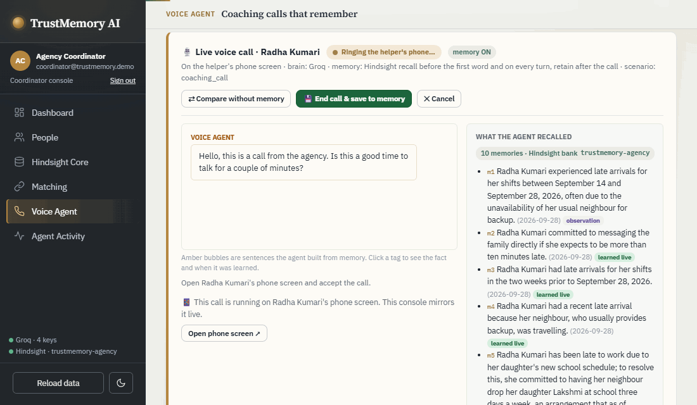
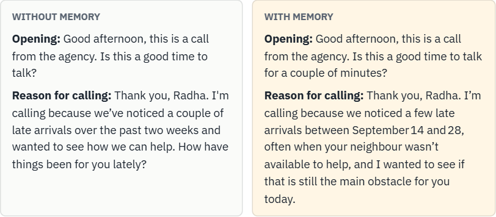
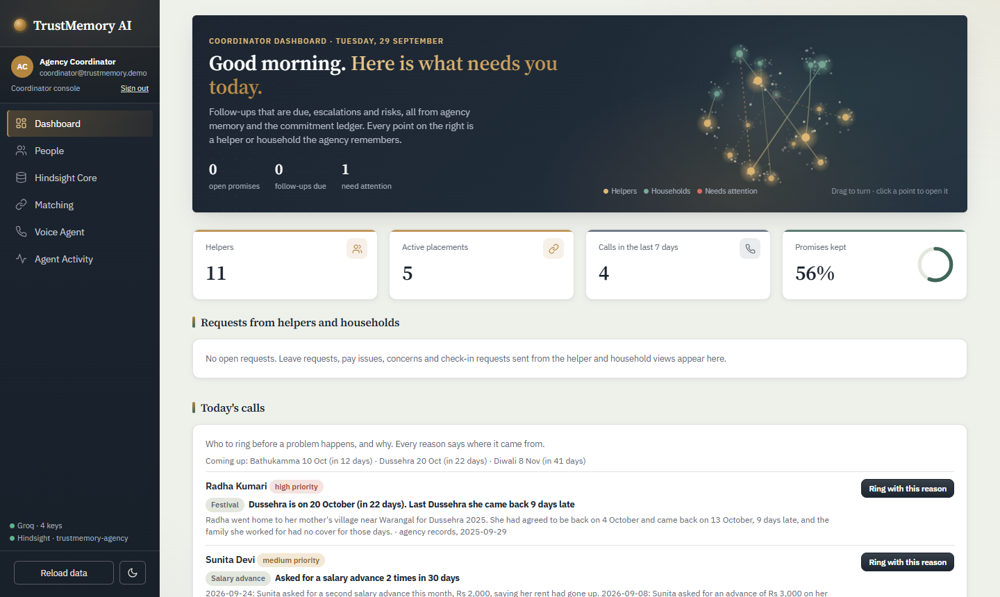
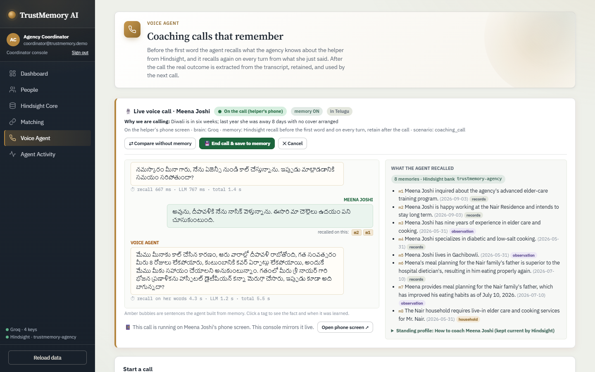
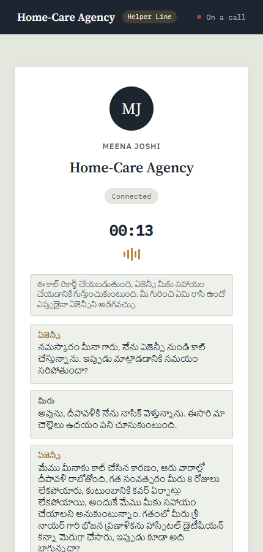
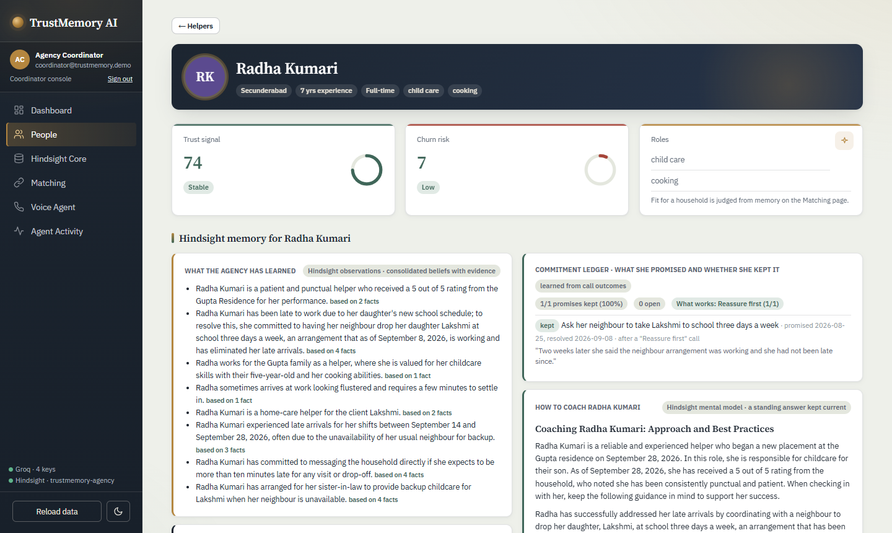
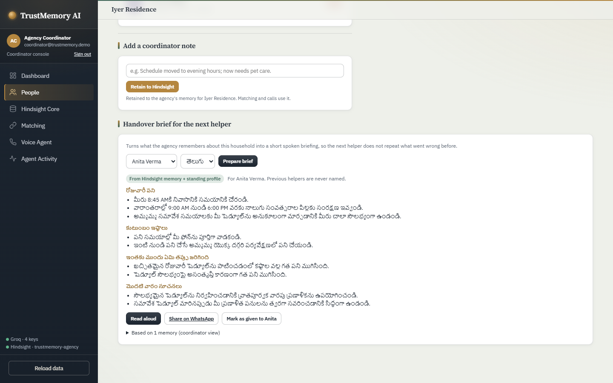
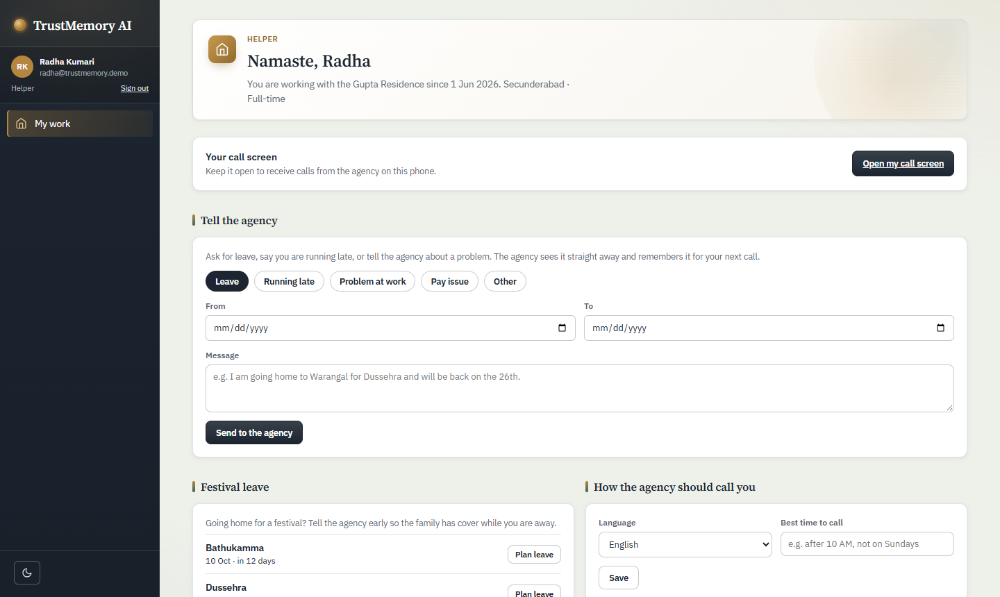
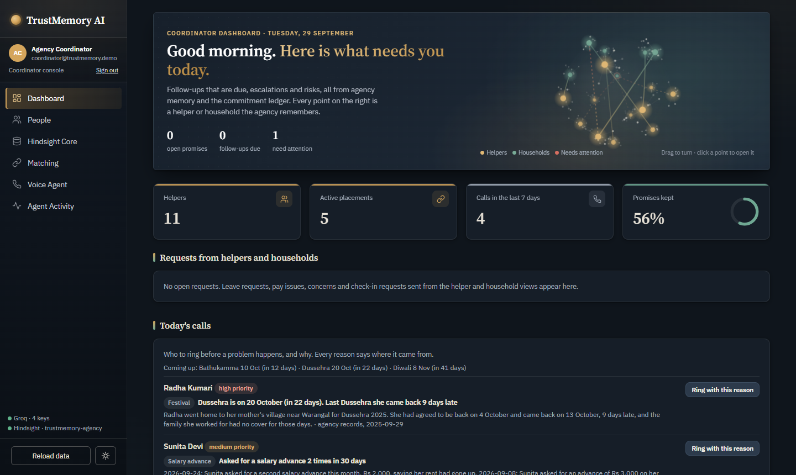
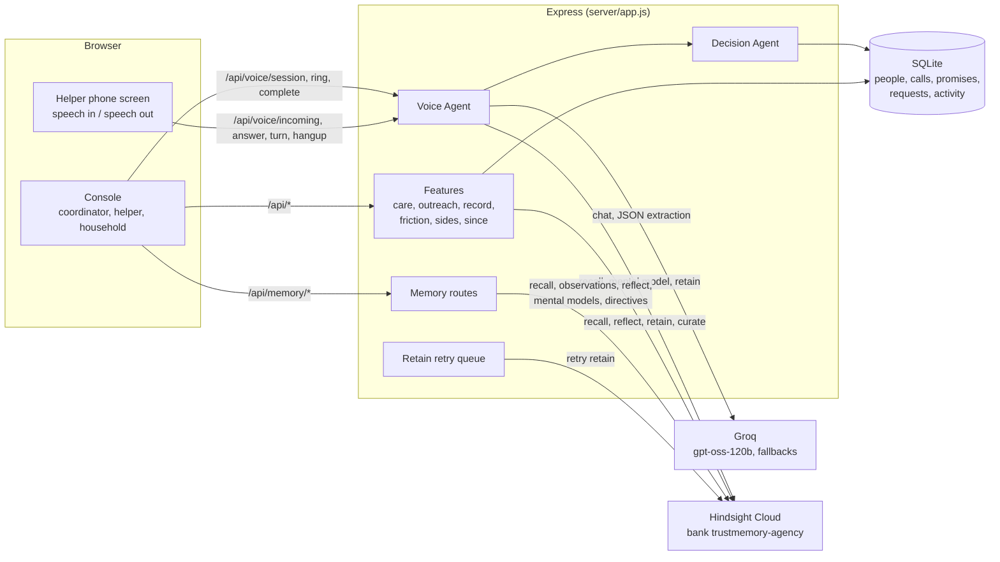

# TrustMemory AI

[](https://github.com/munavathvijay00-spec/TrustMemory-Ai/actions/workflows/test.yml)
    [](https://trustmemory-ai.onrender.com)

> Lakshmi mentioned her salary was late on three calls, weeks apart. No single call sounded alarming.
> TrustMemory noticed the pattern and flagged it, privately, for the coordinator.

**A voice agent for Indian home-care agencies that remembers every helper, built on [Hindsight](https://hindsight.vectorize.io) agent memory.** It calls domestic helpers in English, Hindi or Telugu, recalls what the agency knows before its first word and on every turn, cites every fact it uses, and notices what no single call shows.

| | |
|---|---|
| **Try it** | Open **[trustmemory-ai.onrender.com](https://trustmemory-ai.onrender.com)** and click **Coordinator** under *Explore the demo*. Then **Dashboard → Today's calls → Ring with this reason**. (The free server may take about 50 seconds to wake up.) |
| **Watch** | [Demo video](https://youtu.be/Skc0GNiy0uk) |
| **Proof** | Recall found the right fact for **13 of 13** questions about earlier calls, with **0** results about the wrong helper ([eval](docs/memory-eval.md)) |



## Contents

[The problem](#the-problem) · [What it does](#what-it-does) · [How it uses Hindsight](#how-it-uses-hindsight) · [Does memory help?](#does-memory-help) · [Screens](#screens) · [Run it](#run-it) · [Architecture](#architecture) · [Security and privacy](#security-and-privacy) · [Testing](#testing) · [Limits and roadmap](#limits-and-roadmap)

## The problem

Indian home-care agencies place helpers (elder care, child care, cooking, cleaning) with households. What makes a placement work lives in one coordinator's head: that Radha's daughter's school now starts at 8:00, that she asked not to be called before 10, that last Dussehra she went home and came back 9 days late. When that coordinator is busy or leaves, the agency forgets. The helper quits, or the household is left without cover, or a helper who is being mistreated is never noticed because she only ever hinted at it, one call at a time.

TrustMemory gives the agency a memory, and agents that use it.

## What it does

Most agents with memory use it to answer the next question better. TrustMemory uses memory in ways one conversation can't, and treats it responsibly.

**Across calls**
1. **Calls that remember.** Before the first word and on every turn, the agent recalls the helper's history, her standing profile, her household's expectations and her open promises. Every remembered fact it uses is cited (`[m1]`), and after the call it learns only from what she said, never from what the agent said.
2. **Patterns no single call shows.** When her own words about late pay, long hours or not being allowed out repeat across calls, the coordinator gets a private safety check with her dated quotes. The rules decide whether to flag, memory supplies the evidence, and a person decides what happens next. The household never sees it.
3. **What changed since the last call.** Before ringing her again, the coordinator sees her new promises, requests, corrections, household feedback and memories, newest first.

**Across people**

4. **A household's memory briefs the next helper.** When a placement changes, what the agency learned about a home becomes a briefing for the next helper, in her language, without naming or blaming anyone before her.
5. **Friction before day one.** *Check friction* on the Matching page reads the helper's constraints and the household's expectations, names the likely clashes with dated facts on both sides, and suggests one thing to agree up front.
6. **Both sides of the story.** When a placement is struggling, the household page lines up what each side said, topic by topic, with neutral questions for a mediation call. It never decides who is right.
7. **The agency learns what works.** Every kept or broken promise is stored with the coaching approach that preceded it, so a new helper with no history starts from what worked for others with the same kind of problem.

**Across time**

8. **Calls before problems.** *Today's calls* ranks who to ring and why. "Last Dussehra she came back 9 days late" puts her on the list weeks before this year's festival; repeated salary advances or a promise due for a check-in do too.
9. **Beliefs that explain themselves.** Every consolidated belief has *how it formed*: its earlier versions and the new facts that made Hindsight revise each one, with dates.

**Responsibly**

10. **Seen, corrected and forgotten.** A helper sees what the agency remembers from her own words and can say "This is wrong". Her correction takes priority on the next call, and once the coordinator agrees, the old fact is retired in Hindsight: recall never returns it again, but it can be restored. Temporary facts (unwell, travelling, on leave) older than 30 days are marked as possibly outdated, so the agent asks instead of assuming. A coordinator can have everything about a helper forgotten, confirmed by typing her name.
11. **Scores never reach helpers.** Helpers see what they agreed and what is on record, never a trust or churn number. A Hindsight directive enforces this in every reflection.

**For every role**

- **Coordinators** see everything: dashboard, people, Hindsight Core, matching, the voice agent and the activity log.
- **Helpers** see their promises and calls, plan festival leave, tell the agency about problems, and set when and in which language to be called.
- **Households** give feedback, ask for cover and write what the next helper should know.
- **After a call**, the coordinator can draft a WhatsApp follow-up in the helper's language, built only from what she said and agreed. It is never sent automatically.
- **Neural voices**: with Azure AI Speech configured, the phone speaks Telugu and Hindi in neural voices (`te-IN-ShrutiNeural`, `hi-IN-SwaraNeural`); otherwise it uses the browser's voices.

## How it uses Hindsight

One bank for the agency (`trustmemory-agency`). Every item is tagged `helper:<id>` and/or `household:<id>` and carries a real timestamp, so each recall is scoped to the right person and knows when things were said.

| Hindsight feature | What TrustMemory uses it for | Code |
|---|---|---|
| **Retain** | Call transcripts and summaries, call outcomes with the coaching approach used, coordinator notes and feedback, household feedback, helper requests and corrections | `server/voice-agent.js`, `server/memory-routes.js`, `server/record.js` |
| **Recall** | Before the first word and on every turn of a call, matching evidence, friction checks, since-last-call, the helper's own record | `server/voice/recall.js`, `server/friction.js`, `server/since.js` |
| **Reflect** | Coordinator briefs, who to call today, safety summaries, handover briefs, friction checks, both sides of a story and proposed rules, with JSON response schemas and cited sources | `server/memory-routes.js`, `server/care.js`, `server/friction.js`, `server/sides.js` |
| **Observations** | Consolidated beliefs with their source facts on helper, household and Hindsight Core pages | `server/hindsight.js` (`observations`) |
| **Observation history** | *How it formed*: each earlier version of a belief and the facts that revised it | `/api/memory/observations/:id/history` |
| **Mental models** | A standing profile per helper (`coach-<id>`) and household (`household-<id>`), read before each call and rewritten after | `server/seed-memory.js`, `server/voice-agent.js` |
| **Directives** | Hard rules every reflection obeys: no scores to helpers, respect call windows, helper claims are not policy, commitments before criticism | `server/seed-memory.js` (`DIRECTIVES`) |
| **Curation** | A fact the helper corrected is invalidated once the coordinator agrees, and can be restored | `server/record.js` (`retire`, `restore`) |
| **Documents** | Forgetting a helper deletes every document tagged to her | `server/record.js` (`forget`) |
| **Bank config** | Mission, disposition (empathy 4, skepticism 2, literalism 2) | `server/seed-memory.js` |

If Hindsight is unreachable, retains go to a durable local queue and are retried; dropped connections to Hindsight are retried once.

## Does memory help?

`npm run eval:memory` asks 13 questions the agent needs answered before a call, each about something that only came up on an earlier call, and checks the top 5 recall results against the live bank:

| | Scoped to her (as the app recalls) |
|---|---|
| Right fact in the top 5 | **13 of 13** |
| Right fact ranked first | 10 of 13 |
| Results about a different helper | **0** |
| Median recall time | about 0.8 s |

Full table: [docs/memory-eval.md](docs/memory-eval.md). The console's *Compare without memory* button runs the same call opening with and without memory, live:



## Screens



| Live call, in Telugu | The helper's phone |
|---|---|
|  |  |
| **Helper profile** | **Handover brief** |
|  |  |
| **The helper's own view** | **Dark mode** |
|  |  |

## Run it

### Live

Running at **https://trustmemory-ai.onrender.com**: one Docker web service on Render (Singapore) serving the API and every page, deployed from `dev`, the repository's only branch, with a health check on `/api/health`. It uses the same Hindsight bank as a local run. API keys live in the Render dashboard, never in the repo. The free plan sleeps when idle, so the first visit can take about 50 seconds; local data (calls, requests, sign-ups) resets on each redeploy, while the Hindsight memory is kept.

### Demo accounts

Everything in the demo is made up: the agency, its helpers and its households. The sign-in page has one-click *Explore the demo* buttons for each role, or use:

| Role | Email | Password | What you see |
|---|---|---|---|
| Coordinator | `coordinator@trustmemory.demo` | `TmGHQO0SGMJn24` | The full console |
| Helper (Radha) | `radha@trustmemory.demo` | `TmwQZKv2JgXg81` | Her promises, calls, what the agency has on record, "This is wrong" |
| Household (Gupta) | `gupta@trustmemory.demo` | `Tm8lrJR5KdP912` | Its helper, next check-in, feedback |

Sign-in is shared across tabs in one browser, so use a private window for a second role. To try a full call, sign in as the coordinator, open the helper's phone at `/helper.html?helper=radha` in a second window, switch the line on, then ring her from **Voice Agent** or **Today's calls**. [DEMO.md](DEMO.md) has a timed walkthrough.

### Locally

Requires Node 22.13+ or 24, and Chrome or Edge for speech.

```bash
git clone https://github.com/munavathvijay00-spec/TrustMemory-Ai.git
cd TrustMemory-Ai
npm ci                    # if better-sqlite3 cannot build: npm ci --ignore-scripts
cp .env.example .env      # set GROQ_API_KEYS and HINDSIGHT_API_KEY
npm run seed:memory       # once: dated history, mission, directives, standing profiles
npm start                 # http://localhost:3000
```

| Variable | Needed | What for |
|---|---|---|
| `GROQ_API_KEYS` | yes | The voice agent and extraction; several comma-separated keys rotate |
| `HINDSIGHT_API_KEY` | yes | Hindsight Cloud (or set `HINDSIGHT_API_URL` for a self-hosted server) |
| `DEMO_COORDINATOR_PASSWORD`, `DEMO_HELPER_PASSWORD`, `DEMO_HOUSEHOLD_PASSWORD` | no | Demo account passwords; random ones are printed once if unset |
| `AZURE_SPEECH_KEY`, `AZURE_SPEECH_REGION` | no | Neural Telugu and Hindi voices (region e.g. `centralindia`) |
| `DEMO_ONE_CLICK` | no | `0` hides the one-click demo buttons |
| `TRUST_PROXY` | behind a proxy | `1` on Render, so rate limits see the real client |

`npm run bank:reset -- --yes` returns the bank and local data to the seeded state (without `--yes` it only previews).

- **Docker:** `docker build -t trustmemory . && docker run -p 3000:3000 --env-file .env trustmemory`
- **Render:** create a Web Service from this repo (Docker, health check `/api/health`) or use `render.yaml`, and set the variables above in the dashboard.

## Architecture



The console and the helper's phone share one server-side call session: the phone speaks and listens (Azure neural voices or the browser's own, Web Speech recognition, and a typed fallback), and the console mirrors the transcript live. No telephony provider is involved.

<details><summary><b>The agents, as they exist in code</b></summary>

| Agent | Where | What it does |
|---|---|---|
| Voice | `server/voice/*`, `server/voice-routes.js`, `js/helper-phone.js`, `js/ui/voice-live.js` | The Groq-driven call: recall before the first word and on every turn, `[mN]` citations, ring / answer / hang-up, outcome extraction, save |
| Memory | `server/hindsight.js`, `server/retain-queue.js`, `server/seed-memory.js` | The Hindsight REST client, the durable retry queue, and the seeded dated history |
| Decision | `server/decision.js` | Re-scores churn from the call outcome with a named reason for each change (for example `concrete commitment made (-8)`) |
| Reflection | `server/memory-routes.js` | Observations, "brief me before this call", "who should I call today", and a proposed standing rule the coordinator can approve as a directive |
| Matching | `server/memory-routes.js` (`/api/memory/match`), `server/friction.js` | Ranks candidates with memory evidence and reasons; checks friction with a household before placing |
| Care | `server/care.js`, `server/outreach.js`, `server/commitments.js` | Safety checks across calls, handover briefs, today's calls, and what works across the agency |

</details>

<details><summary><b>API</b></summary>

Everything under `/api` needs a signed-in session except `/api/health` and `/api/auth/*`. Helpers and households reach only `/api/me/*` (and a helper, her own call); every other route is the coordinator's.

| Method | Path | Purpose |
|---|---|---|
| GET | `/api/health` | Liveness, which integrations are configured, DB counts, retains waiting. Never returns secrets |
| POST | `/api/auth/signup`, `/api/auth/login`, `/api/auth/logout` · GET `/api/auth/me` | Accounts: scrypt-hashed passwords, HttpOnly session cookie; new helpers and households start pending |
| GET · POST | `/api/auth/demo` | One-click demo sign-in: which roles are offered; body `{role}` signs in as that demo account |
| GET | `/api/auth/pending` · POST `/api/auth/approve/:id` | Coordinator approves new accounts |
| GET | `/api/me`, `/api/me/helper`, `/api/me/household` · POST `/api/me/feedback` | A helper's or household's own view; household feedback is retained |
| GET, POST | `/api/me/requests` | Requests: leave, running late, pay issue, concern, cover needed, praise |
| GET, PUT | `/api/me/preferences`, `/api/me/household-notes` | Call language and time; what the next helper should know |
| GET | `/api/me/festivals` | Upcoming festivals for leave planning |
| GET | `/api/me/record` · POST `/api/me/record/correction` | The helper's own record (from her words only) and her corrections |
| GET | `/api/helpers`, `/api/households` · POST the same | Roster with trust, churn and difficulty; register a helper or household |
| GET | `/api/dashboard` | Every dashboard number: counts, follow-ups due, escalations, alerts |
| GET | `/api/requests?status=open` · POST `/api/requests/:id/ack` | Coordinator inbox of requests |
| GET | `/api/outreach/today`, `/api/outreach/learning` | Who to ring today and why; what works across the agency |
| GET | `/api/care/safety`, `/api/care/safety/:helperId` · POST `/api/care/safety/:flagId/review` | Private safety checks with the helper's dated words |
| GET | `/api/care/handover/:householdId?helper=&lang=` · POST `.../given` | Handover brief for the next helper (en, hi, te) |
| GET | `/api/friction?helper=&household=` | Likely friction between a helper and a household |
| GET | `/api/sides?household=&helper=` | Both sides of a placement's story, by topic |
| GET | `/api/since?helper=` | What changed since the helper's last call |
| GET | `/api/record/:helperId/corrections` · POST `/api/record/corrections/:id/retire`, `/restore`, `/keep` | Review a helper's corrections; retire invalidates the old fact in Hindsight |
| POST | `/api/record/:helperId/forget` | Delete every memory about a helper; body `{confirm_name}` |
| POST | `/api/voice/session`, `/ring`, `/complete`, `/cancel` | Start a call (recall, opening line), ring her phone, save the outcome (idempotent), discard |
| GET | `/api/voice/incoming?helper=` · POST `/api/voice/answer`, `/turn`, `/hangup` | The phone screen: ringing calls (missed after 60 s), answer, each utterance, hang up |
| GET | `/api/voice/session/:id` | Session state, transcript, result and step timings |
| GET | `/api/voice/tts/status` · POST `/api/voice/tts` | Azure neural speech for the phone screen |
| POST | `/api/voice/followup-draft` | WhatsApp follow-up draft for a completed call |
| GET | `/api/calls`, `/api/activity`, `/api/memories/:helper_id` | Saved calls, agent activity, the local memory ledger |
| GET | `/api/memory/status`, `/api/memory/stats` | Configuration, and Hindsight bank statistics |
| GET | `/api/memory/recall?q=&helper=\|household=` | Raw recall |
| GET | `/api/memory/observations?helper=\|household=` · `/api/memory/observations/:id/history` | Consolidated beliefs with evidence; how one was revised |
| GET | `/api/memory/mental-model?helper=\|household=` · POST `.../refresh` | Standing profile; ask Hindsight to rewrite it now |
| GET | `/api/memory/brief`, `/api/memory/who-to-call`, `/api/memory/suggest-directive` | Reflect: brief the coordinator, who to call today, a proposed rule |
| GET, POST · PATCH | `/api/memory/directives` · `/api/memory/directives/:id` | List, create, enable or disable directives |
| POST | `/api/memory/feedback`, `/api/memory/note` | Coordinator verdict on a call record; a note about a person (both retained) |
| GET | `/api/memory/commitments?helper=`, `/api/memory/metrics`, `/api/memory/match?household=&role=` | Promise ledger, learning metrics, memory-backed matching |

Errors are JSON, `{ "error": "message", "code": "CODE" }`: `400 VALIDATION` or `BAD_JSON`, `401 AUTH_REQUIRED`, `403 FORBIDDEN` or `PENDING`, `404 NOT_FOUND`, `409` for actions on a call that has ended, `413 TOO_LARGE` (over 64 KB), `429 RATE_LIMITED` (30 voice or 60 memory requests a minute, with `Retry-After`), `500 INTERNAL` (no stack trace), `502 MEMORY_UNAVAILABLE`, `503` when Groq or Hindsight is not configured.

</details>

## Security and privacy

- **Roles.** Every `/api` route needs a signed-in session except health and sign-in. Helpers and households reach only `/api/me/*` (and a helper, her own call); everything else is the coordinator's. Tests check each role against each route.
- **What a helper sees.** Only what she said herself, never scores, household feedback, coordinator notes or safety checks. Private safety notes are tagged to the helper alone, so no household-scoped recall, handover brief or household profile can draw on them.
- **Passwords and sessions.** scrypt-hashed passwords, random session tokens in an `HttpOnly`, `SameSite=Lax` cookie (`Secure` behind HTTPS), expired sessions pruned, sign-in lockout after repeated failures.
- **Limits.** Per-client rate limits on voice, memory and sign-in routes; input validation on every write; 64 KB request bodies. Paths are matched the way Express matches them (case, trailing slash), so neither check can be skipped.
- **Headers.** Content Security Policy (this origin plus Google Fonts; no framing), `nosniff`, `X-Frame-Options: DENY`, a strict referrer policy, and the microphone allowed for this origin only.
- **Output.** Every name, note and memory shown in the console is escaped; a test renders the pages with hostile input.
- **Memory.** A call's memory is written to the local retry queue before it is sent to Hindsight, so a crash or restart cannot lose it. Forgetting a helper deletes her Hindsight documents first and changes nothing else unless all of them are gone.
- **Secrets.** API keys live only in the environment (`.env` locally, the Render dashboard live); none are in the repository or its history.

## Testing

```bash
npm test                 # node:test, 114 tests
npm run lint             # ESLint 9: recommended rules for the server, bug rules for the browser console
npm run typecheck        # TypeScript checks the core server files marked // @ts-check (nothing is compiled)
npm run test:browser     # headless Chrome: every page, as every role, on desktop and phone
npm run test:coverage    # fails if server/ line coverage drops below 75% (currently about 88%)
npm run eval:memory      # recall accuracy and leaks between helpers, against the live bank
```

Tests never touch the network or your data: `test/support.js` uses an in-memory database, blanks every API key and replaces `fetch`, and tests that need Groq or Hindsight install a mock that answers like the real API. They cover the full call flow end to end (ring, answer, turns, hang-up, a single saved record even under parallel completes, missed rings, failed retains landing in the retry queue), access control for all three roles, safety checks, handover briefs, corrections and curation, forgetting, friction, both sides, since-last-call and the memory eval. Every call also records step timings (`trace`) on `GET /api/voice/session/:id`.

CI runs lint, the type check and the tests on Node 22 and 24 for every push, plus the coverage check and the browser test on 24. The browser test signs in with the one-click demo buttons as each role, opens every page, and fails on a JavaScript error, anything the Content Security Policy blocks, a server error, "undefined" or "NaN" on screen, or a page wider than a phone.

## Limits and roadmap

**Limits today**
- Calls run in the browser (speech in and out), not over a phone line. The phone screen needs internet for speech recognition; the typed reply box always works.
- Without an Azure key, Telugu is spoken only where the browser has a Telugu voice; otherwise the text is shown.
- Replies take about 2 to 5 seconds on the Groq free tier.
- Standing profiles and safety summaries are rewritten by Hindsight a minute or so after a call.
- One agency, one Hindsight bank. No password reset or email verification yet.

**Next**
- **WhatsApp voice notes.** Most helpers already send voice notes to their agency. Transcribe and retain them like a call, so memory builds between calls too.
- **Missed-call callback.** A helper gives a free missed call and the agent rings her back with her memory loaded, the way many low-income workers in India reach services without spending on talk time.
- **A real phone line** behind a telephony provider, for helpers without a smartphone.
- **Several agencies,** one Hindsight bank each.

<details><summary><b>Project layout</b></summary>

```
server/                  Express app, agents, Hindsight and Groq clients, SQLite
  app.js, index.js       app factory and entry point        shutdown.js       graceful shutdown
  voice/                 the Voice Agent, one module per concern (voice-agent.js re-exports it)
    session.js           start, turn, complete              relay.js          ring, answer, hang up
    recall.js            memory recall, de-dupe             prompt.js         persona system prompt
    citations.js         [mN] citations                     extraction.js     outcome extraction
    session-store.js     sessions + SQLite restore          inflight.js       saves in flight
    trace.js, util.js    step timings, languages            hooks.js          after-call hooks
    tts.js               Azure neural voices                followup.js       WhatsApp follow-up draft
  hindsight.js           Hindsight REST client              memory-routes.js  memory, reflect, matching
  voice-routes.js        Voice Agent routes                 decision.js       Decision Agent
  retain-queue.js        durable retain retries             groq.js           key rotation, model fallback
  care.js                safety checks, handover brief      care-routes.js
  outreach.js            today's calls, agency learning     outreach-routes.js
  commitments.js         promise ledger, what works
  record.js              her record, corrections, forget    record-routes.js
  friction.js            friction before a placement        friction-routes.js
  sides.js               both sides of a story              sides-routes.js
  since.js               what changed since the last call   since-routes.js
  requests.js            requests in people's own words     request-routes.js
  auth.js                accounts, sessions, demo sign-in   auth-routes.js    access rules, /api/me
  people.js              validated helpers and households   db.js, sqlite-compat.js
  seed-memory.js         seeds the bank                     seed/             feature seed history
  reset-bank.js          back to the seeded state           eval-memory.js    the memory eval
  validate.js, rate-limit.js, health-routes.js, logger.js, dates.js (dates in India time), security-headers.js
TrustMemory-AI-modular/  the console for all three roles (index.html) and the helper phone (helper.html);
                         full file map in TrustMemory-AI-modular/README.md
docs/                    screenshots, memory-eval.md
test/                    node:test suites; browser.e2e.js runs the app in headless Chrome
```

</details>

## License

MIT, see [LICENSE](LICENSE).
