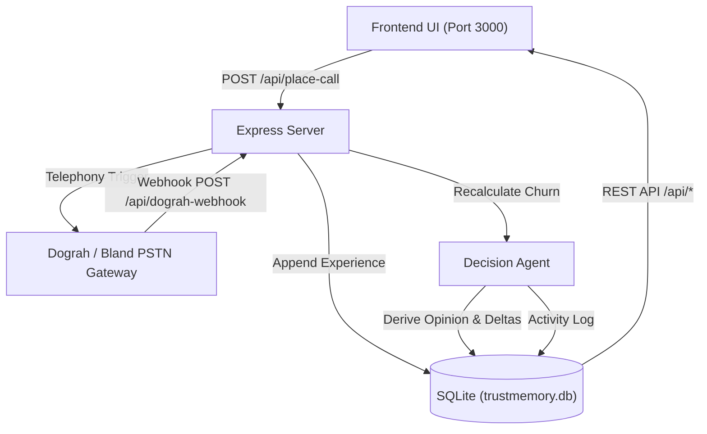

# TrustMemory AI

> **Institutional Memory, Intelligence & Outbound Voice Coaching for Indian Home-Care Agencies.**

TrustMemory AI maintains an institutional memory across four distinct epistemic networks — **World**, **Experience**, **Opinion**, and **Observation** — and acts on it through five collaborative agents:

- 🧠 **Memory Agent (Hindsight Core)**: Retains event records into the Experience Network; manages World, Opinion, and Observation stores.
- ⚖️ **Decision Agent**: Derives honest Trust and Churn Risk scores with explicit `before → after` deltas.
- 📞 **Voice Agent**: Executes outbound coaching, check-in, and escalation calls via **Dograh Telephony** (with Bland AI fallback) under a strict single-destination safeguard.
- 🔍 **Reflection Agent**: Discovers cross-placement patterns and feeds the Observation Network.
- 🤝 **Matching Agent**: Evaluates role-fit and proactively pre-stages backup helpers before placement churn occurs.

---

## 🚀 Quick Start (Single Dev Command)

### 1. Install Dependencies
```bash
npm install
```

### 2. Configure Environment (Optional)
Copy `.env.example` to `.env`:
```bash
cp .env.example .env
```
To enable live physical phone calls, set your Dograh or Bland AI API credentials:
```env
DOGRAH_API_KEY="your_api_key"
DOGRAH_AGENT_UUID="your_agent_uuid"
# or
BLAND_API_KEY="your_bland_key"
```
*(If telephony keys are not set, the platform operates seamlessly in Local Preview & Demo Webhook mode).*

### 3. Run the Unified Server
```bash
npm run dev
```
Open **`http://localhost:3000`** in your browser.

---

## 🏛️ System Architecture



### Epistemic Memory Networks

1. **World Network**: Verifiable, stable facts (helper profiles, skills, household requirements).
2. **Experience Network**: Append-only log of real events (attendance, coaching calls, feedback).
3. **Opinion Network**: Derived assessments (Trust, Churn Risk) computed dynamically from Experience entries.
4. **Observation Network**: Cross-placement patterns synthesized by the Reflection Agent.

---

## 🛡️ Strict Calling Safeguard

TrustMemory AI implements a strict single live destination guard:
- The system **never auto-dials** and **never iterates through helper lists**.
- Outbound calls are constrained strictly to the manually entered phone number.
- Demonstration helper records (`TEST_NUMBER_02`, etc.) are hard-blocked by policy.
- The human coordinator remains the sole authority on who gets called.

---

## 📋 Live Judge Walkthrough

See [DEMO.md](DEMO.md) for the complete 3-minute presentation script, click sequences, and database inspection commands.
